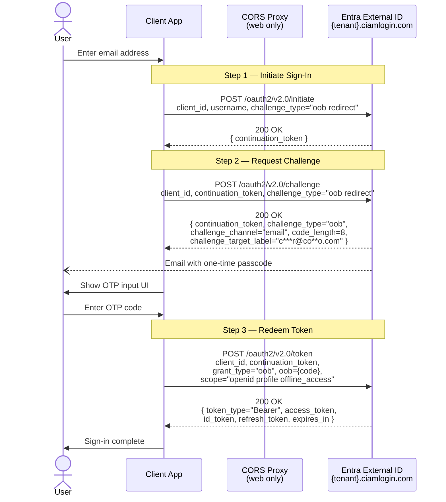
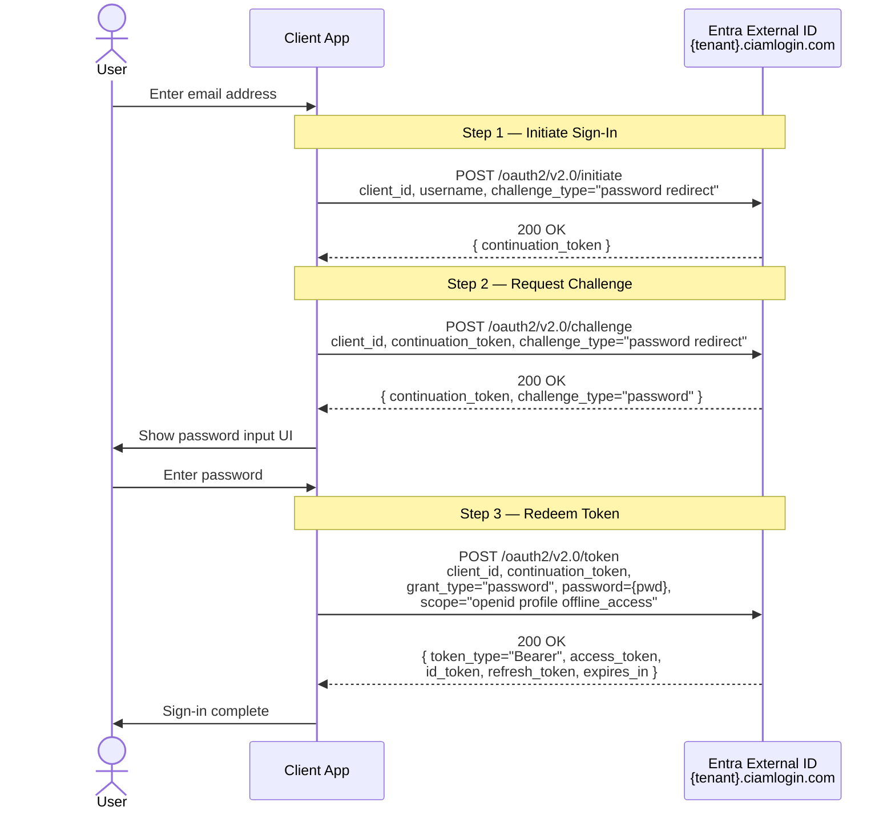
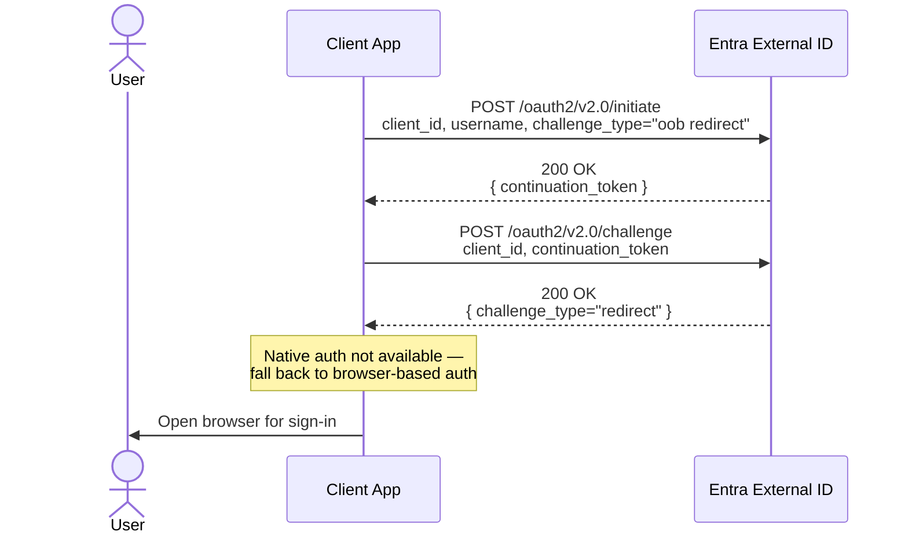
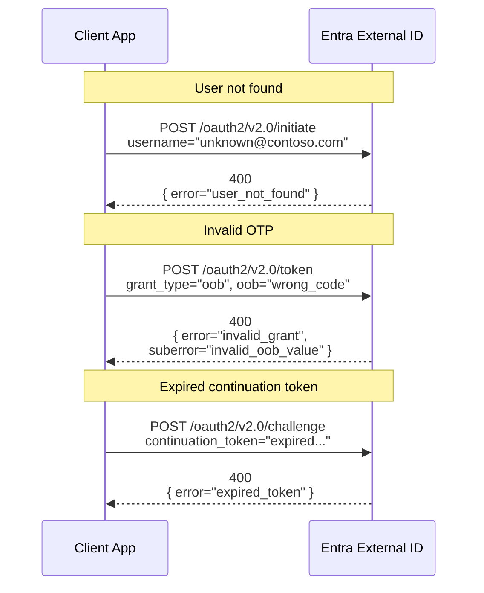

# Native Authentication Sign-In Flow

Reference: [Microsoft Entra Native Authentication](https://learn.microsoft.com/en-us/entra/identity-platform/concept-native-authentication)

## Overview

Native Authentication allows mobile and desktop apps to handle sign-in natively without redirecting users to a browser. The flow uses three endpoints on the tenant's `ciamlogin.com` domain, chained together via **continuation tokens**.

> **Note:** The API does not support CORS. Browser-based apps require a server-side proxy (e.g., `cors.js`).

All requests are `POST` with `Content-Type: application/x-www-form-urlencoded`. All responses are JSON.

**Base URL:** `https://{tenant}.ciamlogin.com/{tenant}.onmicrosoft.com`

---

## Sign-In with Email OTP



---

## Sign-In with Password



---

## Redirect Fallback

If the server cannot fulfill the requested challenge type natively, it returns `challenge_type: "redirect"` and the client must fall back to browser-based authentication.



---

## Error Handling



---

## Endpoint Reference

| Step | Endpoint | Purpose |
|------|----------|---------|
| 1 | `POST /oauth2/v2.0/initiate` | Start sign-in, identify the user |
| 2 | `POST /oauth2/v2.0/challenge` | Select and trigger the auth method (also used to challenge MFA) |
| 3 | `POST /oauth2/v2.0/token` | Submit credentials, receive tokens |
| MFA | `POST /oauth2/v2.0/introspect` | List the user's registered strong auth methods for MFA |
| Reg 1 | `POST /register/v1.0/introspect` | List strong auth methods available to enroll |
| Reg 2 | `POST /register/v1.0/challenge` | Send OTP to the chosen registration target |
| Reg 3 | `POST /register/v1.0/continue` | Submit OTP to complete registration |

## Challenge Type Values

The `challenge_type` parameter must always include `redirect` as a fallback.

| Value | Description |
|-------|-------------|
| `oob` | Out-of-band one-time passcode (email or SMS) |
| `password` | Password-based authentication |
| `redirect` | Fallback to browser auth (**always required**) |

## Multifactor Authentication (MFA)

When a tenant administrator enables MFA for customer users, the sign-in flow gains additional steps after the primary authentication (email with password). Native authentication supports **email OTP** and **SMS OTP** as second-factor methods.

### Capabilities Parameter

To opt in to native MFA handling, include the `capabilities` parameter in your `/initiate` request:

```
capabilities=mfa_required registration_required
```

| Value | Description |
|-------|-------------|
| `mfa_required` | The app can handle the introspect → challenge → token MFA loop |
| `registration_required` | The app can drive the strong-auth-method registration UI |

If the needed capability is missing, Entra returns `challenge_type: "redirect"` and the app must fall back to browser-based auth.

### MFA Flow (Password + Second Factor)

```mermaid
sequenceDiagram
    actor User
    participant Client as Client App
    participant Entra as Entra External ID

    Note over Client,Entra: Steps 1-3 — Password sign-in (as above)
    Client->>Entra: POST /oauth2/v2.0/token<br/>grant_type=password, password={pwd}
    Entra-->>Client: 400<br/>{ error="invalid_grant",<br/>suberror="mfa_required",<br/>continuation_token }

    Note over Client,Entra: Step 4 — Introspect registered MFA methods
    Client->>Entra: POST /oauth2/v2.0/introspect<br/>client_id, continuation_token
    Entra-->>Client: 200 OK<br/>{ continuation_token, methods: [<br/>  { id, challenge_type="oob",<br/>    challenge_channel="email"|"sms",<br/>    login_hint } ] }

    Client->>User: Show MFA method picker
    User->>Client: Select method

    Note over Client,Entra: Step 5 — Challenge for MFA OTP
    Client->>Entra: POST /oauth2/v2.0/challenge<br/>client_id, continuation_token, id={method_id}
    Entra-->>Client: 200 OK<br/>{ continuation_token, challenge_type="oob",<br/>challenge_channel="email"|"sms",<br/>code_length, challenge_target_label }

    Entra--)User: OTP via email or SMS
    User->>Client: Enter OTP

    Note over Client,Entra: Step 6 — Redeem MFA OTP for tokens
    Client->>Entra: POST /oauth2/v2.0/token<br/>client_id, continuation_token,<br/>grant_type=mfa_oob, oob={code},<br/>scope="openid profile offline_access"
    Entra-->>Client: 200 OK<br/>{ access_token, id_token, refresh_token }
```



### Token Endpoint Suberrors (MFA-Related)

| Suberror | Description |
|----------|-------------|
| `mfa_required` | User has a registered strong auth method. Call `/introspect` to list them, then challenge + verify. |
| `registration_required` | User has **no** registered strong auth method. Drive the registration flow before tokens can be issued. |

### SMS OTP — Token Endpoint URL

When verifying an SMS OTP for MFA, use the **tenant ID** form of the token endpoint:

```
POST https://{tenant}.ciamlogin.com/{tenant_ID}/oauth2/v2.0/token
```

instead of the usual `{tenant}.onmicrosoft.com` form.

### Registering a Strong Authentication Method

If the `/token` response returns `suberror="registration_required"`, the user must register an MFA method before tokens can be issued. The registration uses three dedicated endpoints:

| Step | Endpoint | Purpose |
|------|----------|---------|
| 1 | `POST /register/v1.0/introspect` | List methods the user can enroll (email, SMS) |
| 2 | `POST /register/v1.0/challenge` | Send a challenge (OTP) to the chosen target |
| 3 | `POST /register/v1.0/continue` | Submit the OTP to complete registration |

After registration succeeds, call `/oauth2/v2.0/token` with `grant_type=continuation_token` to obtain security tokens.

#### Registration Introspect Response

```json
{
    "continuation_token": "uY29tL2F1dGhlbnRpY...",
    "methods": [
        { "id": "email", "challenge_type": "oob", "challenge_channel": "email",
          "login_hint": "caseyjensen@contoso.com" },
        { "id": "sms", "challenge_type": "oob", "challenge_channel": "sms" }
    ]
}
```

#### Registration Challenge Request

```
POST /register/v1.0/challenge
  continuation_token, client_id,
  challenge_type=oob,
  challenge_channel=email|sms,
  challenge_target={email_or_phone}
```

If the email was already verified during sign-up, the response returns `challenge_type: "preverified"` and no OTP is sent.

#### SMS Fraud Protection Errors

When enrolling a phone number for SMS MFA, the request may be blocked if the number is flagged as high risk:

| Error | Suberror | Description |
|-------|----------|-------------|
| `access_denied` | `provider_blocked_by_admin` | Tenant admin blocked the phone region |
| `access_denied` | `provider_blocked_by_rep` | Phone number blocked by fraud protection |

---

## Token Response Fields

| Field | Description |
|-------|-------------|
| `token_type` | Always `"Bearer"` |
| `access_token` | JWT for calling protected APIs |
| `id_token` | JWT with user claims (requires `openid` scope) |
| `refresh_token` | For silent token renewal (requires `offline_access` scope) |
| `expires_in` | Seconds until access_token expires |

## Key Concepts

- **Continuation Token** — Opaque string returned in each response that must be passed to the next request. Maintains server-side state across the multi-step flow. Each step returns a **new** token; previous tokens become invalid.
- **No CORS** — The API cannot be called directly from browser JavaScript. Web apps need a server-side proxy.
- **Scopes** — Request `openid` for an `id_token`, `profile` for profile claims, `offline_access` for a `refresh_token`.
- **MFA** — When MFA is enabled by the tenant admin, the `/token` endpoint returns `suberror="mfa_required"` or `"registration_required"` instead of tokens. The app must complete the MFA challenge (or register a strong auth method first) before tokens are issued. Supported second factors are **email OTP** and **SMS OTP**.
- **Capabilities** — The `capabilities` parameter (`mfa_required`, `registration_required`) in the `/initiate` request tells Entra the app can handle MFA natively. Without it, Entra falls back to browser-based auth.
